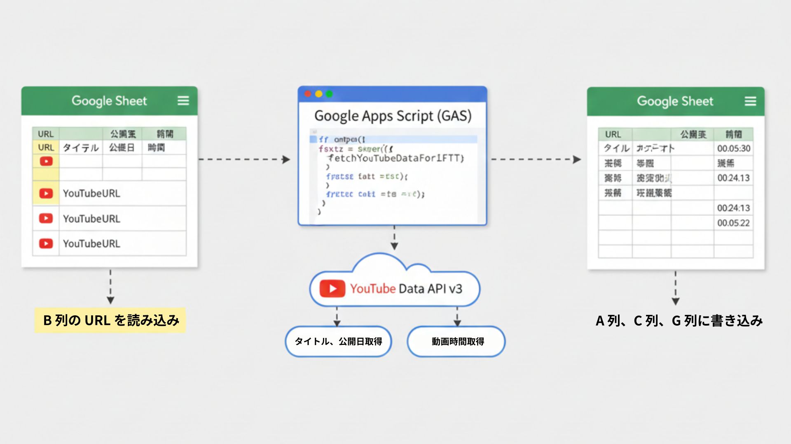

# YouTube動画情報 自動取得ツール (GAS)

このツールは、GoogleスプレッドシートのB列にあるYouTubeのURLから、**「動画タイトル」「公開日」「動画時間（HH:mm:ss）」**を自動で取得し、指定の列に記入するGoogle Apps Script（GAS）です。

## 1. 事前準備：スプレッドシートの構成

このスクリプトは以下の列構成を前提としています。シート名を **「IFTT」** に変更してから使用してください。

| 列番号 | 列名 | 内容 |
| --- | --- | --- |
| **A列** | タイトル | スクリプトが自動記入します |
| **B列** | URL | **YouTubeのURLをここに入力してください** |
| **C列** | 公開日 | スクリプトが自動記入します |
| **G列** | 動画時間 | スクリプトが自動記入します |

> **注意:** すでにA, C, G列がすべて埋まっている行は、処理をスキップします。

---

## 2. 導入手順

### ステップ1：スクリプトエディタを開く

1. スプレッドシートの上部メニューから **「拡張機能」** > **「Apps Script」** をクリックします。

### ステップ2：YouTube APIを有効化する（重要）

1. GASエディタの左メニューにある **「サービス +」** ボタンをクリックします。
2. 一覧から **「YouTube Data API v3」** を探し、選択します。
3. **「追加」** ボタンをクリックします。

### ステップ3：コードの貼り付け

1. もともと入力されているコードをすべて消去し、[最終版のコード] をコピーして貼り付け、保存（フロッピーアイコン）します。

### ステップ4：テストユーザーの登録

YouTube APIはセキュリティが厳しいため、自分のアカウントを「テスター」として登録する必要があります。

1. GASの **「プロジェクトの設定（歯車アイコン）」** > **「プロジェクト番号」** のリンクをクリックし、Google Cloud Consoleを開きます。
2. 左メニュー **「APIとサービス」** > **「OAuth 同意画面」** （または「対象」）を開きます。
3. **「テストユーザー」** 項目にある **「+ ユーザーを追加」** を押し、自分のメールアドレスを入力して保存します。

---

## 3. 実行方法

1. スプレッドシートを一度更新（再読み込み）します。
2. メニューバーに **「⚙️ YouTube情報取得」** というメニューが現れます。
3. **「動画情報を更新 (B列から取得)」** をクリックします。
4. 初回実行時は「承認」が必要です。「詳細」をクリックし、画面下の「[プロジェクト名]（安全ではないページ）に移動」を選んで「許可」してください。

---

## 4. このスクリプトの特徴とこだわり

* **バッチ処理対応:** 1件ずつAPIを叩くのではなく、50件ずつまとめてリクエストするため、動作が非常に高速です。
* **0時間埋めフォーマット:** 動画時間を `00:15:30` のように、常に「時:分:秒」の形式で揃えています。これにより、スプレッドシート上での並び替えや計算がスムーズになります。
* **エラー耐性:**
* URLが正しくない場合や、ライブ配信中で時間が確定していない動画があっても、エラーで止まらずに処理を続行します。
* 取得に失敗した項目は、上書きせずに空欄のまま保持します。

* **APIクォータの節約:** すでにデータが入力されている行は処理をスキップするため、無駄なAPI通信を行いません。

---

## 5. よくある質問 (FAQ)

**Q. エラーが出て動かなくなりました。**
A. YouTube Data API には1日の利用制限（クォータ）があります。大量（数千件以上）のURLを一気に処理しようとすると制限にかかることがありますが、翌日にはリセットされます。

**Q. ショート動画 (Shorts) には対応していますか？**
A. はい、対応しています。通常の動画と同じ形式のURLであれば問題なく情報を取得できます。